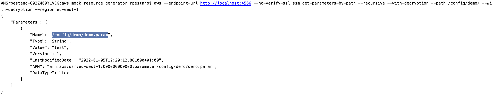
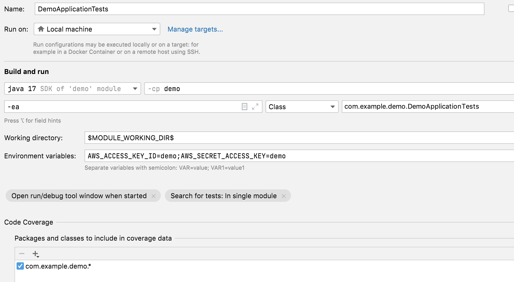

= Spring aws parameter store issue

Cannot fetch parameters from ssm parameter store

== How to reproduce?

. Start docker compose in root dir: `docker-compose up`
.. It will start ssm mock service with a parameter under the path: `/config/demo` like image below:
+

. Run `DemoApplicationTests` passing aws credentials as enviroment vars:
+

. The application will connect to the store but won't be able to fetch the parameters:
+
----
Caused by: java.lang.IllegalArgumentException: Could not resolve placeholder 'demo.param' in value "${demo.param}"
	at org.springframework.util.PropertyPlaceholderHelper.parseStringValue(PropertyPlaceholderHelper.java:180)
	at org.springframework.util.PropertyPlaceholderHelper.replacePlaceholders(PropertyPlaceholderHelper.java:126)
	at org.springframework.core.env.AbstractPropertyResolver.doResolvePlaceholders(AbstractPropertyResolver.java:239)
	at org.springframework.core.env.AbstractPropertyResolver.resolveRequiredPlaceholders(AbstractPropertyResolver.java:210)
	at org.springframework.context.support.PropertySourcesPlaceholderConfigurer.lambda$processProperties$0(PropertySourcesPlaceholderConfigurer.java:175)
	at org.springframework.beans.factory.support.AbstractBeanFactory.resolveEmbeddedValue(AbstractBeanFactory.java:936)
----

[NOTE]
====
To run via maven (`mvn test`) you need to export the env vars before:

----
export AWS_ACCESS_KEY_ID=demo
export AWS_SECRET_ACCESS_KEY=demo
export AWS_REGION=
----

====
